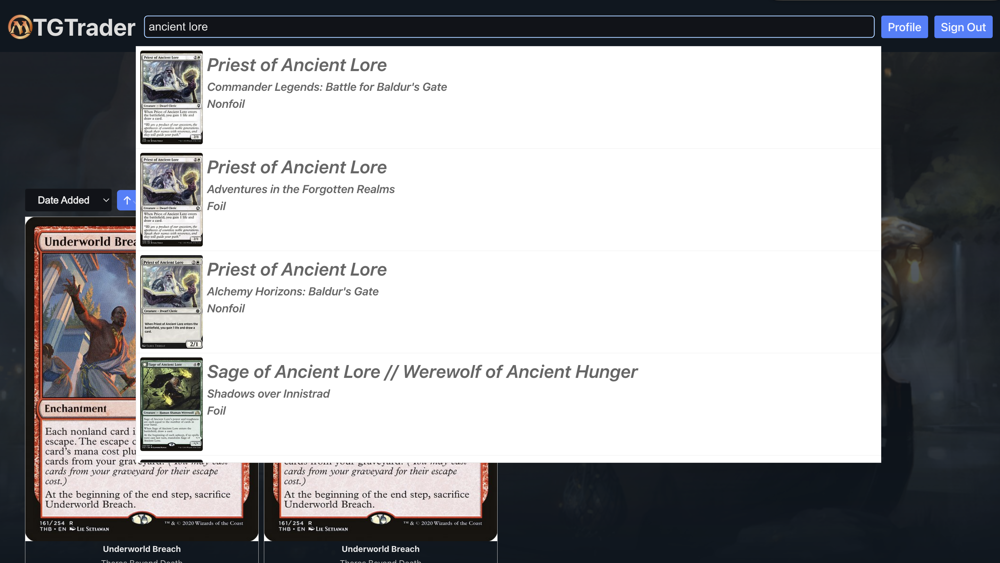

## MTGTrader
This project aims to create a web based application for trading Magic the Gathering cards while learning how to use React and fastapi.

The app allows users to create an acount and upload cards from their collection that they wish to trade away. They can also list cards 
they are looking to trade for and search to see other users who have those cards. By initiating a trade with another user you can negaotiate which cards 
you have that the other wants in order to setup a mutually beneficial trade.

## Live Demo

You can view the live, deployed version of the application here (may not avaliable at all times as I am using free service):

[**https://mtgtrader.netlify.app/**](https://mtgtrader.netlify.app/)

## Project Architecture

The frontend of this project is built using React with typescript and tailwind for css styling. The pages directory defines each of the pages of the site which are assigned
a specific url path. The components directory contains React components that are designed to be used multiple times across the site with flexibility in their props to make them 
easily reausable. Vite is used for ease of development in local deployments.

The backend uses fastapi with a SQLModel database. The models.py files contain all the definitions of SQLModels that are used to populate, read, or write from the table. The main models include User to store user information, Card which stores cards listed by users, and TradeOffer which tracks trade information between 2 users as they trade. The routes directory contain the endpoints of the api and are split to handle each of the main models.

## Example Screenshots

<p align="center">
  
</p>

<p align="center">
  <em>Profile Page to view sort or add cards</em>
</p>

<p align="center">
  
</p>

<p align="center">
  <em>Search Page with autocomplete search results</em>
</p>

## Local Deployment Quick Start

To run this application locally for development purposes, follow these steps assuming you have the latest versions of Conda and Node.js installed:

1.  Clone the repository in the desired directory
  

2.  Setup frontend:

    ```bash
    cd frontend/
    npm install
    npm run dev
    ```

3.  Setup backend:
    ```bash
    cd backend/
    conda create --name MTGTrader
    conda activate MTGTrader
    conda install fastapi uvicorn sqlmodel sqlalchemy passlib pydantic bcrypt==4.3.0 python-jose
    uvicorn app.main:app --reload
    ```

    The application should now be running on a local port.

---
